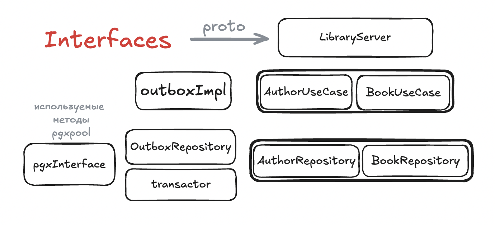
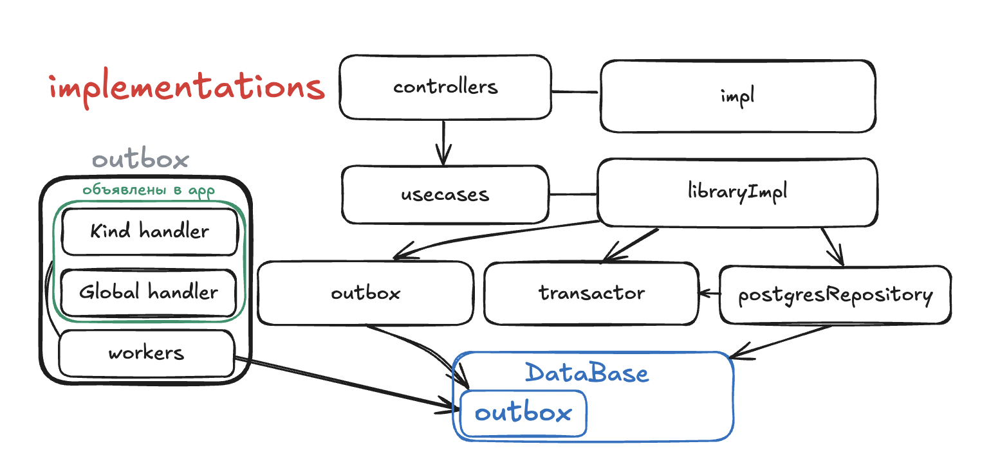
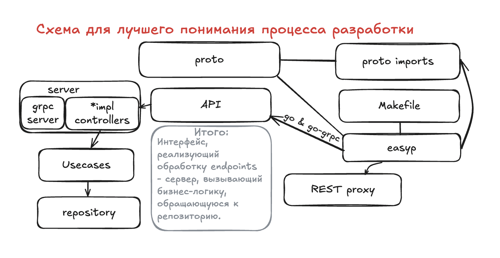

# Library

Сервис позволяет хранить и модифицировать данные о книгах и авторах.

Запуск: docker compose up -d

Можно запустить локально, но Makefile полностью определен лишь для Linux и MacOS.

## Документация
[README.md](./docs/README.md) в ./docs

## Разработка

## Observability
Т.к. traces нужны в случае взаимодействия нескольких сервисов, реализовано упрощение.
* Внутри endpoint создается trace.

В opentelemetry плохо работают метрики

## Унификация технологий
* Структура проекта [go-clean-template](https://github.com/evrone/go-clean-template)
* Для логирования [zap](https://github.com/uber-go/zap)
* Для валидации [protoc-gen-validate](https://github.com/bufbuild/protoc-gen-validate)
* Для поддержики REST-to-gRPC API [gRPC gateway](https://grpc-ecosystem.github.io/grpc-gateway/)

## Тестирование
* Код тестов можно посмотреть в файле [integration_test.go](./integration-test/integration_test.go)
* Для прохождения интеграционных тестов необходимо записать переменные окружения для инициализации конфига, см: [README](./cmd/library/README.md)

## Авторские заметки
* Для трейсов используется jaeger, устаревший экспортер -> otlp
* Для понимания Makefile и easyp можно заглянуть в Go-CT-Learning репозиторий (private).
* Комментарии в Makefile стоит писать ТОЛЬКО в отдельных строках
