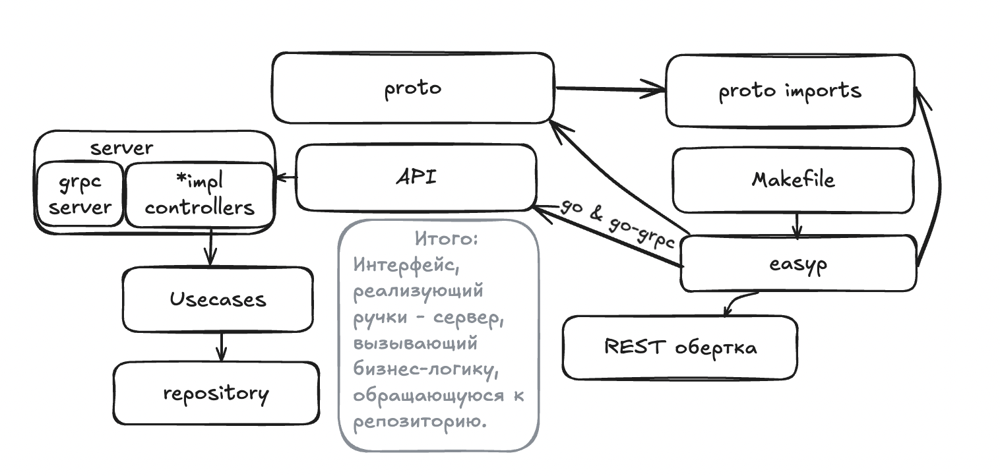
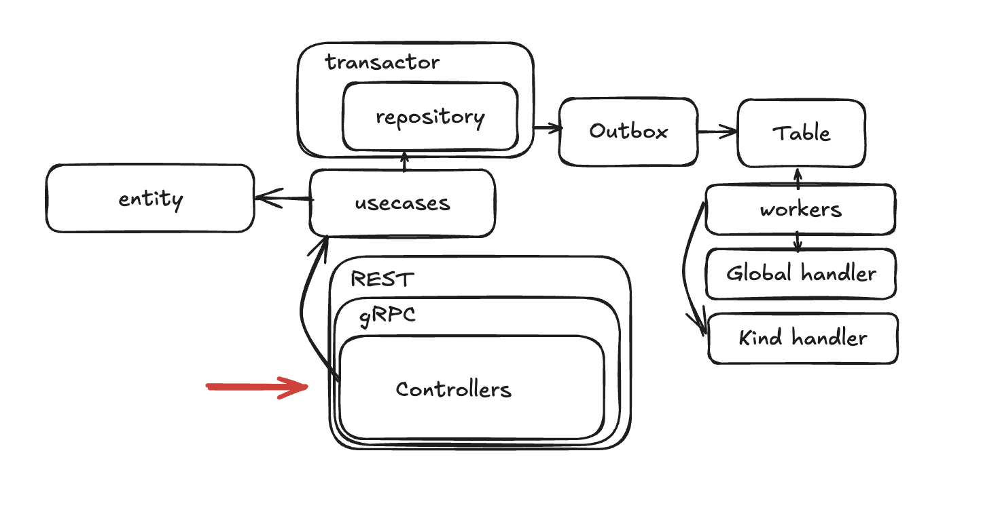

# Library

### Схема с outbox:

## API

## Унификация технологий
Для удобства выполнения и проверки дз вводится ряд правил, унифицирующих используемые технологии

* Структура проекта [go-clean-template](https://github.com/evrone/go-clean-template)
* Для логирования [zap](https://github.com/uber-go/zap)
* Для валидации [protoc-gen-validate](https://github.com/bufbuild/protoc-gen-validate)
* Для поддержики REST-to-gRPC API [gRPC gateway](https://grpc-ecosystem.github.io/grpc-gateway/)

## Тестирование в CI
* Код тестов можно посмотреть в файле [integration_test.go](./integration-test/integration_test.go)

## Документация
[README.md](./docs/README.md) в ./docs

## Авторские заметки
* Для понимания Makefile и easyp можно заглянуть в Go-CT-Learning репозиторий (private).